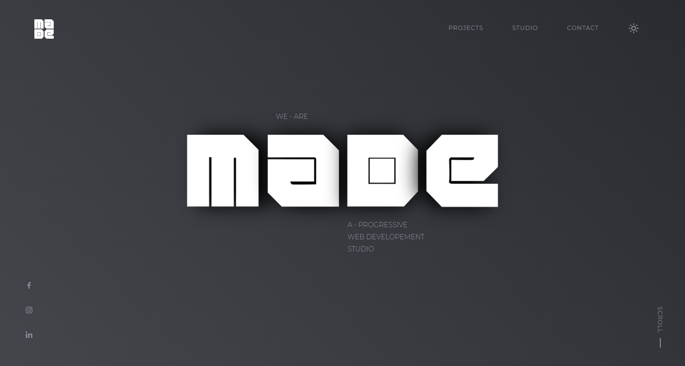
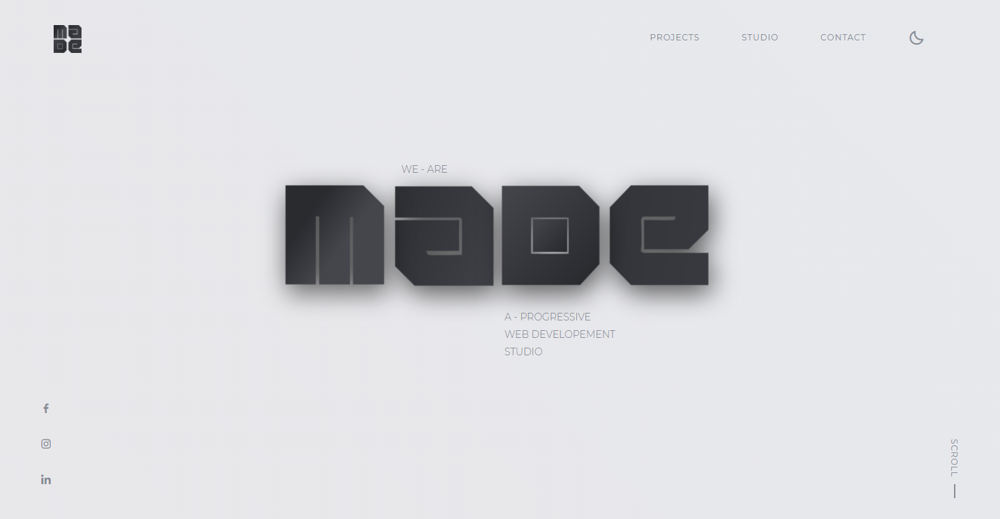

# Made Profession | Dark & Light Web UI

# Dark Mode



# Ligh Mode



> Pure CSS - Only Css No any other external plugins

To clone this project run the following command in your terminal

```
    git clone https://github.com/Vetrivel-VP/made_dark_light_web_ui.git
```

Follow Us On

Our Online Tutorial Website : [Code With Vetri](https://codewithvetri.web.app/)

Developed by : [Vetrivel Ravi](https://codewithvetri.web.app/) with ❣
